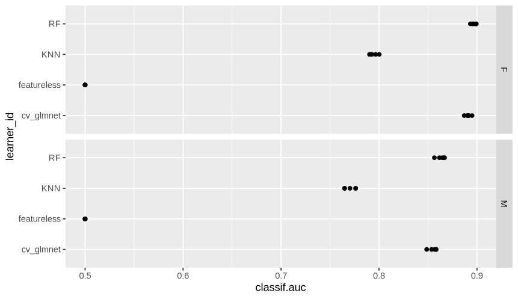
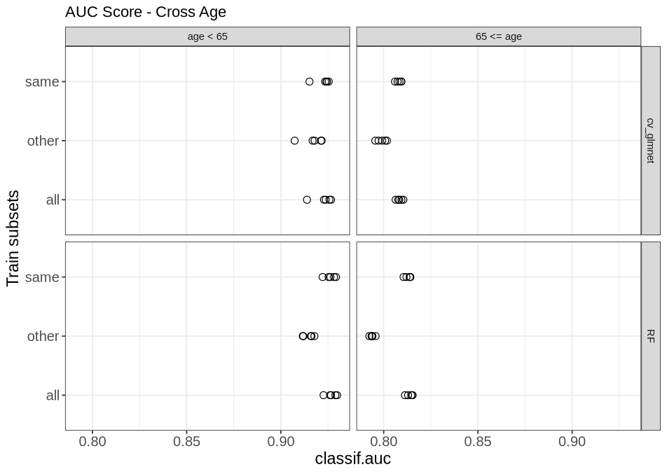
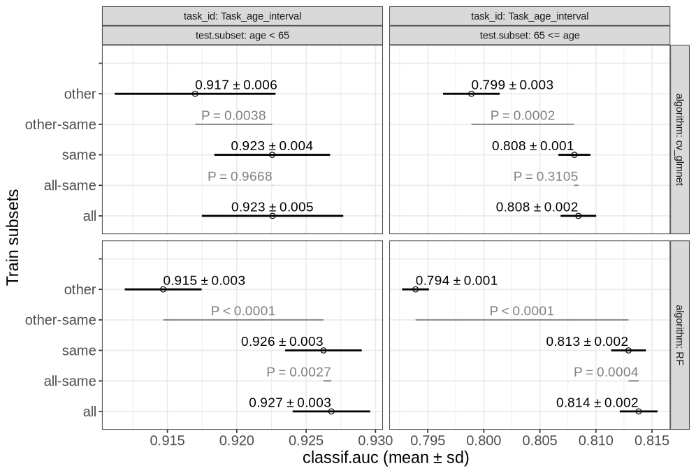
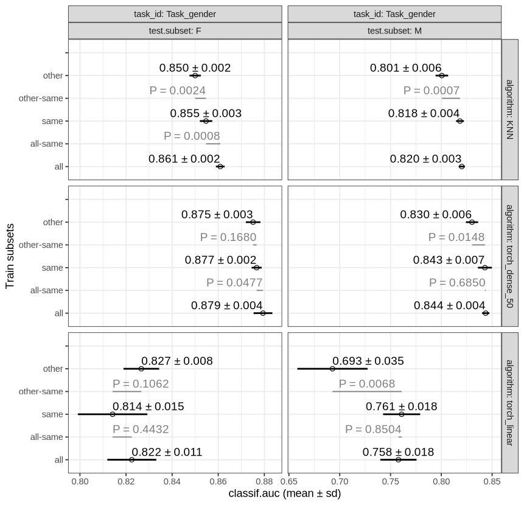
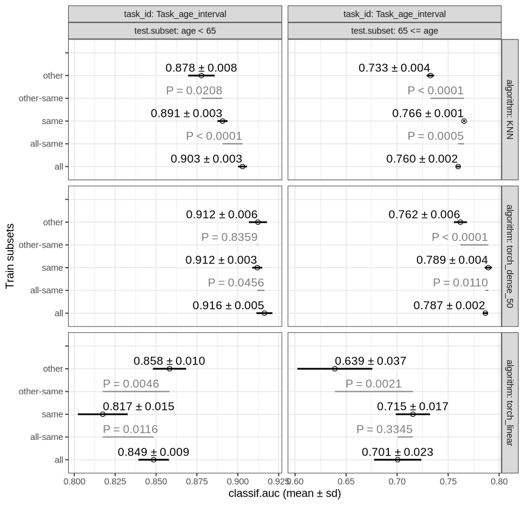
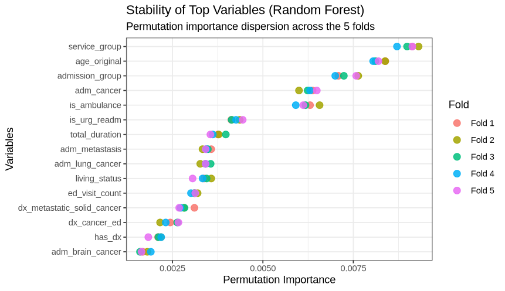
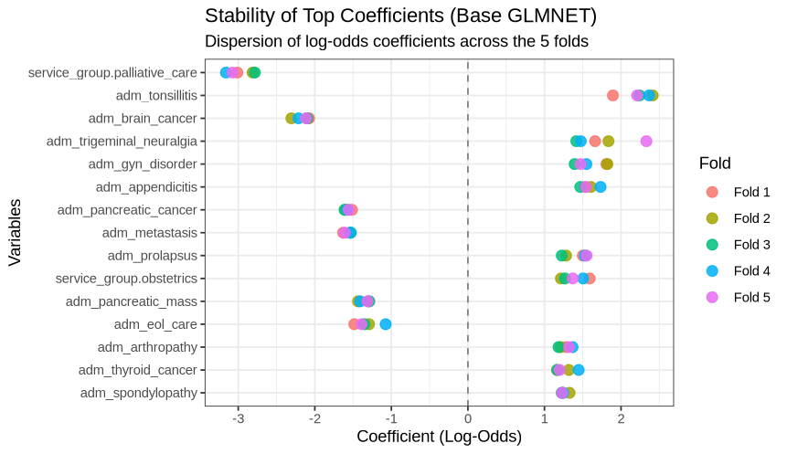

# Model Fairness, Robustness, and Interpretability in Medical Data (R)

**Presentations**

- [Slides: Phase 1 & 2 - Baseline CV and Robustness](https://www.canva.com/design/DAHNVsic6PQ/cBcqfPzgyDizGb628E_sVw/edit)
- [Slides: Phase 3 - Hyperparameter Tuning & Neural Networks](https://www.canva.com/design/DAHP7hqw0Gc/_nJXpF3bNHlC1L4ZbXy3bQ/edit)
- [Slides: Phase 4 - Model Interpretability & Feature Importance](https://www.canva.com/design/DAHR3usZrJU/PE7-ch_eTJ1bKnHoRW9j1w/edit?ui=eyJFIjp7Im0iOnRydWUsIkE_IjoibiJ9LCJLIjp7fX0)

### Abstract

This project predicts 1-year mortality using the [Laribi et al. (2024)](https://zenodo.org/records/12954673) synthetic medical dataset. We evaluate model performance across specific groups: Gender and Age (\< 65 vs. \>= 65).

We start with simple cross-validation, then move to grouped cross-validation using the SOAK method to prevent data leakage and test model robustness across demographic subsets. After evaluating baselines, a tuned KNN, and neural networks, we compare the feature importance of our best models (Random Forest and cv_glmnet) against the statistical tests used in the original paper.

------------------------------------------------------------------------

## Phase 1 & 2: Baseline Models, Grouping, and Robustness

[subset_experiment_1.R](Experiment_1/subset_experiment_1.R) reads the synthetic dataset and runs a simple 5-fold cross-validation on a subset of models: Random Forest (via `ranger`), `cv_glmnet`, default KNN, and a featureless baseline. It also introduces patient-level grouping to prevent data leakage and utilizes SOAK for cross-subset experiments to assess robustness across Age and Gender.

**Outputs:**

| AUC (Age) | p-value (Age) |
|:----------------------------------:|:----------------------------------:|
|  | {width="378"} |

| AUC (Gender) | p-value (Gender) |
|:----------------------------------:|:----------------------------------:|
|  |  |

**Key Insights:**

- Adding patient grouping is critical; without it, overlapping patient visits artificially inflate model performance (data leakage).
- Evaluating strictly on the same subset (train on males, test on males) provides a baseline, but the cross-subset SOAK experiments reveal how robust the models actually are when generalizing across demographics.

------------------------------------------------------------------------

## Phase 3: Hyperparameter Tuning & Neural Networks

[subset_tuned_experiment.R](Experiment_2/subset_tuned_experiment.R) attempts to push performance further by introducing a tuning grid search for KNN and implementing two neural network architectures using `torch`: a linear model and a multi-layer perceptron (1 hidden layer, 50 neurons). The networks were trained over 200 epochs with early stopping to capture learning dynamics.

**Outputs:**  p-values and Mean AUCs (Gender)

 p-values and Mean AUCs (Age)

**Key Insights:**

- Despite tuning and the complexity of the 50-neuron hidden layer, neither KNN nor Torch outperformed the Random Forest and `cv_glmnet` models.
- The figures demonstrate the training dynamics and justify abandoning the deep learning approach in favor of the more efficient and interpretable models for this specific dataset.

------------------------------------------------------------------------

## Phase 4: Interpretability & Feature Importance

[comorbidities_experiment.R](Experiment_3/comorbidities_experiment.R) extracts the top-15 variables from our two best models (RF and glmnet) to see if they align with the major comorbidities identified in Laribi et al. (2025).

**Outputs:**

 

**Key Insights:**

- Both of our machine learning models and the original paper perfectly agree on the three most critical risk factors: `age`, `service_group`, and `adm_urgence` (urgent admission).
- The importance rankings of specific comorbidities differ between our models and the paper.
- **Hypothesis:** This divergence is likely due to methodological differences. The paper uses univariate statistical tests (Welch's t-test and Pearson's chi-squared), which assess variables in isolation. In contrast, Random Forest (permutation) and `glmnet` (multivariate coefficients) evaluate the predictive power of variables *in the presence of all others*. Also, because big factors like age, service, and urgency do most of the heavy lifting, the smaller variables (like comorbidities) shift around in importance depending on how the specific model works.
